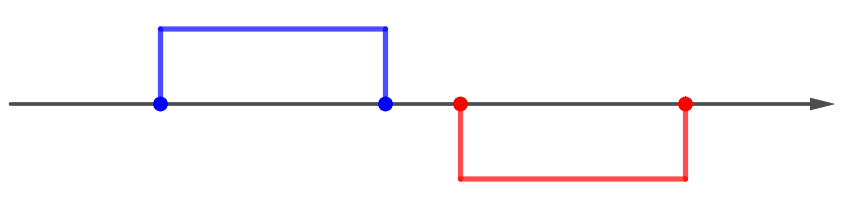

# Задание 2: Ветвление, циклы

## Задача 1: Расписание
Напишите программу, которая выдает по номеру урока время его начала и конца.
**Пример входных данных:** 

| Ввод | Вывод                                         |
|------|-----------------------------------------------|
| 1    | Время начала урока - 8:30, Время конца - 9:15 |

- **Файл**: `task1.py`

## Задача 2: Время года
Напишите программу, которая получает номер месяца и 
выводит соответствующее ему время года или сообщение об ошибке.
**Пример входных данных:** 

| Ввод | Вывод                 |
|------|-----------------------|
| 5    | Весна                 |
| 15   | Неверный номер месяца |

- **Файл**: `task2.py`

## Задача 3: Кол-во лет

Напишите программу, которая получает возраст человека 
(целое число, не превышающее 120) и выводит этот возраст со словом «год», 
«года» или «лет». Например, «21 год», «22 года», «25 лет».

**Пример входных данных:** 

| Ввод | Вывод   |
|------|---------|
| 16   | 16 лет  |
| 1    | 1 год   |
| 22   | 22 года |

- **Файл**: `task3.py`

## Задача 4: Степени 2

Ввести число N и вывести на экран все степени числа 2 от 21 до 2N

**Пример входных данных:** 

| Ввод | Вывод |
|------|-------|
| 3    | 2 4 8 |

- **Файл**: `task4.py`

## Задача 5: Числа

Найдите все пятизначные числа, которые при делении на 133 дают в остатке 125, а при делении на 134 дают в остатке 111.

- **Файл**: `task5.py`

## Задача 6: Числа Армстронга

Натуральное число называется числом Армстронга, 
если сумма цифр числа, возведенных в N-ную степень (где N – количество цифр в числе) 
равна самому числу. Например, 153 = 13 + 53 + 33. Найдите все трёхзначные числа Армстронга.

- **Файл**: `task6.py`

## Задача 7: Простые числа

Простое число – это число, которое делится только само на себя и на 1. 
Ввести натуральное число N и вывести все простые числа в диапазоне от 2 до N.

- **Файл**: `task7.py`

## Задача 8: Ход слона

Даны две различные клетки шахматной доски. Напишите программу, которая определяет, 
может ли слон попасть с первой клетки на вторую одним ходом. 
Программа получает на вход четыре числа от
1 до 8 каждое, задающие номер столбца и номер строки сначала для первой клетки, потом для второй клетки. 
Программа должна вывести «YES», если из первой клетки ходом слона можно попасть во вторую, или «NO» в противном случае.

Формат входных данных
На вход программе подаются четыре числа от 1 до 8

Формат выходных данных
Программа должна вывести текст в соответствии с условием задачи.

Примечание. Шахматный слон ходит по диагоналям.

- **Файл**: `task8.py`

## Задача 9: Ход коня

Даны две различные клетки шахматной доски. Напишите программу, которая определяет, 
может ли конь попасть с первой клетки на вторую одним ходом. Программа получает на вход четыре числа от 
1 до 8 каждое, задающие номер столбца и номер строки сначала для первой клетки, 
потом для второй клетки. Программа должна вывести «YES», если из первой клетки 
ходом коня можно попасть во вторую, или «NO» в противном случае.

Формат входных данных
На вход программе подаются четыре числа от 1 до 8

Формат выходных данных
Программа должна вывести текст в соответствии с условием задачи.

Примечание. Шахматный конь ходит буквой «Г».

- **Файл**: `task9.py`

## Задача 10: Ход ферзя

Даны две различные клетки шахматной доски. Напишите программу, которая определяет, 
может ли ферзь попасть с первой клетки на вторую одним ходом. Программа получает на вход четыре числа от 
1 до 8 каждое, задающие номер столбца и номер строки сначала для первой клетки, 
потом для второй клетки. Программа должна вывести «YES», если из первой клетки 
ходом коня можно попасть во вторую, или «NO» в противном случае.

Формат входных данных
На вход программе подаются четыре числа от 1 до 8

Формат выходных данных
Программа должна вывести текст в соответствии с условием задачи.

Примечание. Шахматный ферзь ходит по диагонали, горизонтали или вертикали.

- **Файл**: `task10.py`

## Задача 11: Пересечение отрезков

На числовой прямой даны два отрезка: [a1, b1] [a2, b2]. 
Напишите программу, которая находит их пересечение.

Пересечением двух отрезков может быть:

Отрезок

Точка

Пустое множество

Формат входных данных
На вход программе подаются четыре целых числа a1, b1, a2, b2, каждое на отдельной строке. 
Гарантируется, что a1 < b1, a2 < b2.

Формат выходных данных
Программа должна вывести на экран границы отрезка, являющегося пересечением, либо общую точку, либо текст «пустое множество».

- **Файл**: `task11.py`

